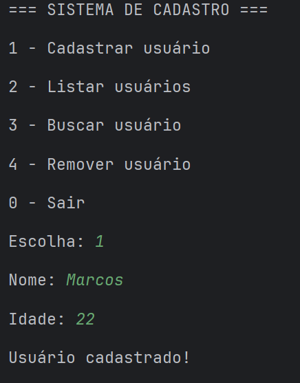

# Sistema de Cadastro em Java

Projeto de sistema de cadastro em Java desenvolvido para praticar Programação Orientada a Objetos, estrutura de dados e lógica de programação com menu interativo no console.

## Funcionalidades
- Cadastrar usuário
- Listar usuários
- Buscar usuário
- Remover usuário
- Menu interativo no console

## Tecnologias utilizadas
- Java
- POO (Programação Orientada a Objetos)
- ArrayList
- Scanner

## Objetivo
Este projeto faz parte dos meus estudos em Java com foco em desenvolvimento back-end.

## Demonstração

## Como executar
1. Clone o repositório
2. Abra o projeto em uma IDE Java (IntelliJ, Eclipse ou VS Code)
3. Execute a classe Main.java
4. Utilize o menu no console
